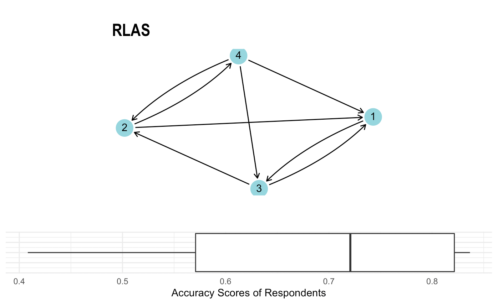

```{r setup, include=FALSE}
knitr::opts_chunk$set(echo = TRUE)
```

>_Christiaan van Rensburg, Alexander Cawood, Marette Theron (2019)_

`Rfrenz` is an _**experimental**_ package which simplifies the process of computing cognitive social network accuracy by combining various functions from other packages. Specifically, `Rfrenz` provides functions to compute and plot different types of criterion networks as well calculate respondents' accuracy using cognitive slice data.

Usage
--------------------
`frenz_stats` - Computes basic descriptive statistics on accuracy of respondents

`formatting_data` - Plots criterion network and the respondents accuracy scores 

`get_accuracy` - Computes accuracy of respondents 

`get_criterion` - Computes criterion network from all perceptions 

`get_data` - Imports text data and converts to socio-matrix data 

`rfrenz_acc` - Computes accuracy from slices 


The Rfrenz package can then be loaded using the `library` function.
```{r warning=FALSE}
library('Rfrenz')
```

### Generating Test Data

The data below represents the cognitive slices of five respondents:
```{r generate_data}

r1 <- matrix(c(0,1,0,1,0,
              0,0,1,1,0,
              1,0,0,1,1,
              0,1,0,0,1,
              0,1,0,1,0),nrow=5, ncol=5)
r2 <- matrix(c(0,1,1,1,0,
              0,0,1,1,0,
              1,0,0,1,0,
              1,1,0,0,1,
              1,1,0,1,0),nrow=5, ncol=5)
r3 <- matrix(c(0,1,1,1,0,
              1,0,1,1,0,
              1,1,0,0,0,
              0,1,0,0,1,
              1,1,0,1,0),nrow=5, ncol=5)
r4 <- matrix(c(0,1,0,1,0,
              1,0,1,1,1,
              1,0,0,1,1,
              0,1,0,0,0,
              0,0,0,1,0),nrow=5, ncol=5)
r5 <- matrix(c(NA,NA,NA,NA,NA,
              NA,NA,NA,NA,NA,
              NA,NA,NA,NA,NA,
              NA,NA,NA,NA,NA,
              NA,NA,NA,NA,NA),nrow=5, ncol=5)

list_respondent <- list(r1,r2,r3,r4,r5)

```


## The Rfrenz function
This function generates a criterion (true) network given all the perceptions perceived in a network. The criterion network is then compared to all perceptions in order to determine the similarity between a respondent and their perception of the network.

#### Arguments 

`dat` - A list of socio matricies that represent respondents.

`criterion` - A true (criterion) netwrok of the socio matricies to be computed.

`accuracy` - An accuracy measure to be computed

`option` - An option that determines how missing values will be dealt with. options: "zero", "remove", "replace"

```{r warning=FALSE}
rfrenz_acc(list_respondent, criterion = "ILAS", accuracy = "s14", option = "remove")
```

#### Values
The `rfrenz_acc` function returns a list of 2 items. The first is the criterion network. The second is a dataframe containing an accuracy score for each respondent

## The Data 

### Get Data

The get\_data function can be used to read in data from a directory containing comma seperated binary values in a text files, where each text file represents a respondent.

```{r Get Data, eval=FALSE}
get_data(path, save = FALSE, path_out)
```

### Formating Data
Remove/Replace Missing Slices

This function removes any missing perceptions (slices) from a list of socio-matrices. Three different options exist: removing missing slices, replacing missing slices with central graph or replacing missing values with 0.

#### Missing data is important to consider

Missing data can affect the formation of the actual networks. In order to deal with this, missing perceptions can be set to a blank perception (0), or replaced with an estimate value, or the missing respondents can be omitted.

#### Arguments

`dat` -  A list of socio-matrices containing all of the perceptions of a network
`option` -  Option whether to remove or replace missing values ("remove", "replace", "zero")

##### Option Paramater
`"remove"` - This option will omit the missing values completely. Omitting the missing respondents results in effectively sampling the original data [@Borgatti2006]. 

`"replace"` - This option will replace the missing values of the obeserver with the central graph consensus of the network.

`"zero"` - This option will replace all the missing values of the obeserver with the value 0 [@Krackhardt2002].

#### Values

A list of socio-matracies with the removed/replaced slices within the list

#### Example
```{r Formatting Data , warning=FALSE}
formatting_data(list_respondent, option = "replace")
```

### Mock Data

There are two main public examples of CSS data that is often used for demonstration. These two datasets have been loaded into the R enviroment when the Rfrenz package is called. 

#### High Tech Managers data on advice and friendship relations.

##### Description
This data collected from the managers of a high-tech company.
The company manufactured high-tech equipment on the west coast of the United States and had just over 100 employees with 21 managers.
Each manager was asked who they regarded as a friend aswell as who they would most likely go to for advice. They were also asked to identify their perception of these relationships for each other manager in the company.

##### Format
This data contains a list of socio-matrices. Each element in the list - a slice - contains a respondent's perception of the network. Each slice exists out of binary data where a '0' corresponds to no relationship obeservered and visa versa.

##### Example
```{r}
data <- (Rfrenz::hightech_advice)
slice_6 <- data[[6]]
slice_6
```

#### Silicon Systems data on advice and friendship relations
 
##### Description 
Krackhardt asked employees at Silicon Systems, a high-tech firm that was undergoing a union certification campaign, to whom they go to for advice and who they thought other employees went to for advice. This same process was done for friendship relationships between the employees.
These relationships provide insight into the firm's embedded social structure.
Silicon Systems has a list of 36 respondent perceptions.

##### Format
This data contains a list of socio-matrices. Each element in the list - a slice - contains a respondent's perception of the network. Each slice exists out of binary data where a '0' corresponds to no relationship obeservered and visa versa.

##### Example
```{r}
data <- (Rfrenz::silsys_advice)
slice_6 <- data[[6]]
slice_6
```

## Criterion

### Get Criterion

This function generates a criterion (true) network given all the perceptions perceived in a network. Several algorithms for determining criterion networks are available to best suit the context of the network.

#### Arguments:

`dat` - A socio-matrix containing all of the perceptions of a network

`criterion` - The criterion network needed to be generated (“RLAS”, “CLAS”, “ILAS”, “ULAS”, “GA”, “GAT”, “GAV”, “SR”, “IR”, “PCA”, “RB”, “BAY”)

`option` - An option that determines how missing values will be dealt with. options: "zero", "remove", "replace"

#### Example:
```{r Get Criterion, warning=FALSE}
crit <- get_criterion(list_respondent, criterion='RLAS')
crit
```

#### Values:
The function returns a socio-matrix representing the Criterion ('true') Network structure

#### Theory
Criterion (also called true or actual) networks are representative of the notion of shared or common perceptions of social structures from all observers within a network. Various different algorithms exist to derive these actual networks namely: Local Aggregate Structures (LAS), Consensus Structures and Expert Structures [@Krackhardt1987a][@Cornelissen2019].

##### **Local Aggregate Structures (LAS)**

LAS is suitable in a context to generate a criterion which suggests that only the individuals directly involved in the relation determine the existence of the relation.

###### **RLAS: Row-Dominated LAS**
An RLAS criterion is created by determining whether or not the perceiver observes the relationship to exist, even though the receiver does not always necessarily deem it to exist [@Krackhardt1987a]. Thus, the sender of the relationship will determine the correctness of the relationship. 

Function used: consensus from the SNA package [@Butts2016].

###### **CLAS: Column-Dominated LAS**
CLAS is created by determining whether or not the receiver of the relation perceives the relation to exist. Thus, the receiver of the relationship will be assumed as correct with their perception. 

Function used: consensus from the SNA package [@Butts2016].

###### **ILAS: Intersection LAS**
ILAS criterion networks are created by determining whether or not both respondents perceive the tie to exist. Thus, both respondents have to agree on the relationship in order for it to exist [@Krackhardt1987a]. 

Function used: consensus from the SNA package [@Butts2016].

###### **ULAS: Union LAS**
ULAS defines relations to exist if at least one of the respondents involved in the relation perceives it to exist [@Krackhardt1987a]. 

Function used: consensus from the SNA package [@Butts2016].

##### **Consensus Structures**

###### **GA: Global Aggregate**
Using Global Aggregate to generate actual networks is not so much focused on who perceived a specific relations, but rather how many perceived that relation. This is done by taking the sum of relationships that exists for each observer.

###### **GAT: Global Aggregate with a threshold**
The threshold is set to measure the proportion of members that perceive a relation between the sender and receiver of the relationship. This corresponds to a “median response” notion of creating an actual network.

Function used: consensus from the SNA package [@Butts2016].

###### **GAV: Global Aggregate (valued)**
To gain a clearer understanding of the global perception of a relation, one could make use of proportions rather than showing only the presence or absence of a perceived relation (i.e. the GAT method). Thus, this method shows which percentage of observers who perceived the relationship.

##### **Expert Structures**

###### **SR: Single Reweight**
The reweight method takes a consensus structure to create an initial criterion network. The reweight method is then applied to give a more accurate representation of the perceptions in the network. This is done is by performing consensus structure reduction on the data again but with different perceivers weighted according to their accuracy in perceiving relations in original criterion network. The single reweight method is when there is only one additional reduction done using the reweighted nodes.

Function used: consensus from the SNA package [@Butts2016].

###### **IR: Iterative Reweight**
Similar to Single Reweight except this method applies multiple reductions to weigh perceivers differently in each iteration. This can be useful when there is a disconnect between different perceptions which results in relations which are not accurate or don't exist. IR tries to find the most accurate perceivers in the network in order to give their perceptions of relations more validity when determining the criterion network. 

Function used: consensus from the SNA package [@Butts2016].

###### **RB: Romney Batchelder**
Similar to Single Reweight method but with an exception to the motivation. Romney Batchelder theory's motivation lies in the measurement of shared beliefs in a group. The criterion is built on the “cultural competency” weighted perceptions. Measuring “cultural competency” of respondents is done by determining the correlation between the responses of each individual and the aggregated responses of the group.

###### **PCA: Principal Component Analysis**
The PCA method for generating actual networks uses the first component of a network. PCA extracts shared themes among all the respondents within a network [@Butts2016]. PCA reduces the dimensions and relationships considered in a dataset while still maintaining the most important information within it.

Function used: consensus from the SNA package [@Butts2016].

###### **BAY: Bayesian**
Network accuracy model method can be used to generate the criterion network given the probability of false positives and false negatives. For more information see [Bayesian](https://rdrr.io/cran/sna/man/bbnam.html).

Function used: consensus from the SNA package [@Butts2016].

## Accuracy 

### Get Accuracy

The purpose of this function is to get the accuracy scores for each respondent in a social network based on their perception of the network. This is done by checking the similarity between their perception and a criterion network (i.e., a network that best represents the relations in a network).

#### Arguments

`dat` - A list of socio matrices that represent respondents.

`criterion` - A sociomatrix that represents the criterion network (i.e., a network that best represents the relations in a network) that is computed from all respondents.

`acc` - The name of the accuracy measure to be computed. Options: “pearson”, “spearman”, “jaccard”, “kendall”, “s14”, “mrqap”, “gscor”, “CohenK”, “local”, “triadic pearson”, “triadic spearman”, “triadic distance”.

`criterion_type` - The name of the criterion that has been used.

`option` - An option that determines how missing values will be dealt with. options: "zero", "remove", "replace"

```{r Get Accuracy, warning=FALSE}
acc_df<- get_accuracy(list_respondent, crit, acc = "pearson", criterion_type = "RLAS")
acc_df
```

#### Values
A dataframe of respondents and their accuracy scores.

### Theory

#### Interpersonal Accuracy
##### **Pearson Correlation**
The Pearson correlation test is done using a function from the [SNA](https://cran.r-project.org/web/packages/sna/sna.pdf) package called `gcor`. The SNA package states that “gcor” function is used to find the product-moment correlation between adjacency matrices [@Butts2016]. The “gcor” is a specialised form of a standard “cor” correlation. The ”gcor” function focuses more on graph data. Scores larger than 0 show a positive correlation whereas scores below 0 show a negative correlation.

##### **Spearman Correlation**
The Spearman correlation test is performed using the `cor.test` function from the [stats](https://stat.ethz.ch/R-manual/R-devel/library/stats/html/00Index.html) package. The estimate value is extracted from the results of the test. This value represents the similarity score computed from the correlation. According to the Stats package the rho statistic is used to compute the estimate value of the ranked based measure of association [@DeNooy2016]. A Spearman correlation test is best suited for data that can be ranked. Scores larger than 0 show a positive correlation whereas scores below 0 show a negative correlation.

##### **Jaccard Correlation**
The Jaccard similarity coefficient is performed using the `jaccard` function that is found in the [Jaccard](https://cran.r-project.org/web/packages/jaccard/jaccard.pdf) package. This function will result in a number between 0 and 1. The closer the value is to 1 the higher the similarity is between the two matrices. The Jaccard similarity coefficient is used in social science as it shows the occurrences of agreements between binary sets of data [@Marineau2016a]. The Jaccard correlation does not account for relationships that do not exist (both values are 0).

##### **Kendall Rank Correlation**
The Kendall rank correlation is performed using the `kendall` function that is found in the [Kendall](https://cran.r-project.org/web/packages/sna/sna.pdf) package. The Kendall rank correlation or more commonly known as Kendall's Tau, is a correlation tool used to measure the ordinal association between two measured variables [@Kendall1938]. The “Kendall” function computes a p-value and if it is determined to be significant (such that variables are dependent), there are ties. Then it will check the similarity between these variables. The Kendall Tau statistic variable is extracted from the results of the Kendall Tau function.

##### **S14 Similarity Index**
The S14 similarity index is performed using the `s14` function that is found in the [cssTools](https://cran.r-project.org/web/packages/cssTools/index.html) package. The S14 function computes the similarity between the two square matrices. S14 is useful for network data as it shows appropriate sensitivity to small changes and does not distort at extremes [@Gower1986].

##### **MRQAP with Double-Semi-Partialing (DSP)**
MRQAP with DSP is performed using the `mrqap.dsp` function that is found in the [Asnipe](https://cran.r-project.org/web/packages/asnipe/asnipe.pdf) package. This function computes the regression coefficient using the DSP method. The method randomises the p-value with 1000 permutation in order to determine if the matrices are dependent or independent [@Dekker2003]. If it is determined to be dependant then the ties exist.

##### **Cohens Kappa**
The Cohens Kappa coefficient can be determined using the `cohen.kappa` function that can be found in the [psych](https://cran.r-project.org/web/packages/psych/psych.pdf) package. This accuracy measure takes the possibility of chance into account (i.e., someone could have merely guessed about a relationship within a given network and the measure takes that probability into account) (Cohen, 1960). Target accuracy measures refer to how accurate a perceiver's agreement would be towards a certain target, where the target would be the relationship between i and j [@Neal2016].

##### **Local Accuracy**
The local accuracy is computed by comparing a person's perceptions to a Row dominated local aggregate structure (RLAS). local accuracy tries to see how accurate a person is at knowing the perceptions in a social network based on how they think the people in that network perceive them [@Casciaro1999]. A pearson correlation is performed between a row of a person's perceptions and a row of the RLAS criterion.

##### **Dyadic Accuracy**
Dyadic accuracy looks at how accurately an individual can perceive a possible dyadic relation between two individuals. To do this it takes one person's perceptions and measures its perception of dyadic relations according to the actual social network [@Bondonio1998].

#### Intermediate Accuracy
##### **Triadic (Pearson, Spearman, Distance)**
The triadic accuracy compares the triadic structure of the criterion network and the respondent by means of either a Pearson correlation, Spearman's rank correlation, or Euclidean distance measure. This approach was proposed by @Frenz2019 as a means to compare the degree of similarity between the triad census of the actual social network and the triad census of a respondents cognitive slice.

#### Structural Accuracy
##### **Structural Correlation (gscor)**
The structural correlation between two or more graphs can be determined using the `gscor` function found in the [SNA](https://cran.r-project.org/web/packages/sna/sna.pdf) package. The gscor function finds the product-moment structural correlation. It looks at the structure of each network and determines how similar the structures are (Butts and Carley 2001). The node labels in the network are permutated in order to determine how similar the structure is to the actual network [@Butts2001].

## Plotting

### Rfrenz plot
This function can be used to quickly plot a summary of the `get_criterion()` and `get_accuracy()` functions in one place. The function allows you to plot the criterion alone or with an accuracy-score summary in the form of a boxplot. If you want to plot the criterion alone , you only have to pass a criterion-matrix to the function.

#### Arguments

`crit` - criterion network returned after get_criterion() is run. the crit is used to plot a criterion network.

`accuracy_df` -Default = FALSE. If you have an accuracy dataframe from the `get_accuracy()` function you can past it to the parameter here. A boxplot is plotted of for the various accuracy scores.

`criterion` - default="RLAS". the criterion name of the criterion being past in crit. is used as a titile for the graph.

```{r warning=FALSE, eval=FALSE}
frenz_plot(crit, acc_df,criterion="RLAS")
```


```{r fig.align='center', echo=FALSE, out.width="70%"}

```

#### Values

The Plot function returns a network graph of the criterion network that is passed into it and a box and whisker graph showing summary statistics of the data.

## Basic Statistics on accuracy scores

This function accepts a dataframe from the output of the get_accuracy() function and is based on the Score coloumn. The function returns a dataframe with the basic descriptive statistics added to each observation. These statistics as as follows:

##### Mean
The Average Accuracy Score

##### Min
The Least Accurate Score

##### Max
The Most Accuracy Score

##### Median
The Median of the Accuracy Scores

#### Arguments

`accuracy_df`	- The accuracy dataframe that results from the get_accuracy() function.

```{r}
stats<-frenz_stats(acc_df)
stats
```


# References
